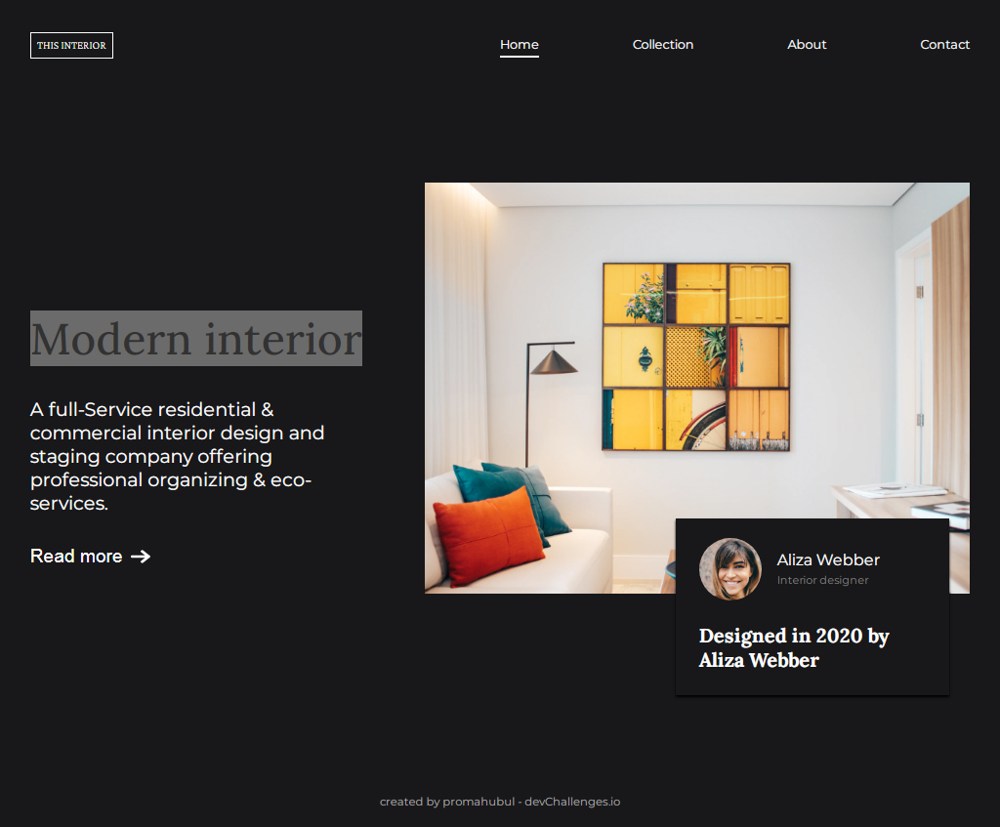
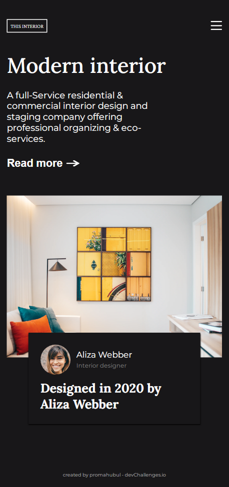

<!-- Please update value in the {}  -->

<h1 align="center">{Modern Interior}</h1>

   Solution for a challenge from  <a href="http://devchallenges.io" target="_blank">Devchallenges.io</a>.

  <h3>
    <a href="https://main--stellular-cucurucho-ef15aa.netlify.app/">
      Demo
    </a>
     | 
    <a href="https://devchallenges.io/paths/responsive-web-developer/solutions">
      Solution
    </a>
     | 
    <a href="https://devchallenges.io/paths/responsive-web-developer">
      Challenge
    </a>
  </h3>

<!-- TABLE OF CONTENTS -->

## Table of Contents

- [Overview](#overview)
  - [Built With](#built-with)
- [Features](#features)
- [Contact](#contact)
- [Acknowledgements](#acknowledgements)

<!-- OVERVIEW -->

## Overview

###### Desktop

###### Mobile

### Built With

- [HTML](#)
- [CSS](#)

## Features

<!-- List the features of your application or follow the template. Don't share the figma file here :) -->

This application/site was created as a submission to a [DevChallenges](https://devchallenges.io/challenges) challenge. The [challenge](https://devchallenges.io/challenges/Jymh2b2FyebRTUljkNcb) was to build an application to complete the given user stories.

## Contact

- Website [promahbubul.hashnode.dev](https://promahbubul.hashnode.dev/)
- GitHub [@promahbubul](https://github.com/promahbubul)
- Twitter [@promahbubul](https://twitter.com/promahbubul)
